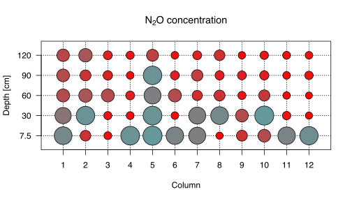
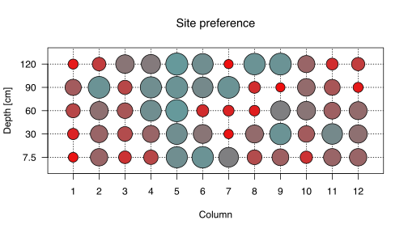
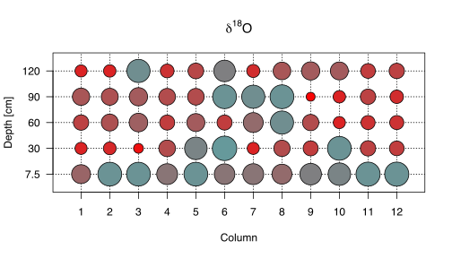

# Process Rate Estimator
Damian Oswald
September 23, 2023

# Introduction

Denitrification is the natural process by which nitrate
(NO3-) in the soil are converted by bacteria into
nitrous oxide (N2O) or pure nitrigen (N2). The
latter is called *total denitrification* — the full process described in
[Equation 1](#eq-denitrification) takes place.

$$
\ce{NO3^- ->[\text{Nitrate}][\text{reductase}] NO2^- ->[\text{Nitrite}][\text{reductase}] NO ->[\text{Nitrite oxide}][\text{reductase}] N2O^- ->[\text{Nitrous oxide}][\text{reductase}] N2}
 \qquad(1)$$

Denitrification occurs in conditions where oxygen is limited, such as
waterlogged soils. It is part of the nitrogen cycle, where nitrogen is
circulated between the atmosphere, organisms and the earth.

# The data

The study uses data collected from a mesocosm experiment – i.e. an
outdoor experiment that examines the natural environment under
controlled conditions. The experiment was set up as a randomized
complete block design, with 4 varieties and 3 replicates, using 12
non-weighted lysimeters. A non-weighted lysimeter is a device to measure
the amount of water that drains through soil, and to determine the types
and amounts of dissolved nutrients or contaminants in the water. Each
lysimeter had five sampling ports with soil moisture probes and
custom-built pore gas sample, at depths of 7.5, 30, 60, 90 and 120 cm
below soil surface.

$$4 \times 3 \times 5 \times 161 = 9660 \qquad(2)$$

[Equation 2](#eq-dimension) shows how many observations we should expect
to have. In reality, some observations are missing.

| Code        | Name                           | Description                                                                         |
|:------------|:-------------------------------|:------------------------------------------------------------------------------------|
| `date`      | Date (`YYYY-MM-DD`)            | Year + DOY                                                                          |
| `column`    | Column                         |                                                                                     |
| `depth`     | Measurement depth              |                                                                                     |
| `increment` | Height of a specific layer     |                                                                                     |
| `variety`   | Wheat variety                  |                                                                                     |
| `moisture`  | Soil moisture                  |                                                                                     |
| `N2O`       | Corrected N2O conc. |                                                                                     |
| `CO2`       | Corrected CO2 conc. |                                                                                     |
| `SP`        | Site preference                |                                                                                     |
| `d15Nbulk`  |                                |                                                                                     |
| `d15Nalpha` |                                |                                                                                     |
| `d15Nbeta`  |                                |                                                                                     |
| `d18O`      |                                | Ratio of stable isotopes oxygen-18 (18O) and oxygen-16 (16O). |

# Formal model description

## Model parameters

| Symbol              | Code          | Name                                                                                 | Value                         | Unit                        |
|:--------------------|:--------------|:-------------------------------------------------------------------------------------|:------------------------------|:----------------------------|
| $BD$                | `BD`          | Bulk density (mass of the many particles of the material divided by the bulk volume) | $1.686$                       | g cm-3           |
| $\theta_w$          | `theta_w`     | Soil volumetric water content                                                        |                               |                             |
| $\theta_a$          | `theta_a`     | Air-filled porosity                                                                  | $1-\frac{\theta_w}{\theta_t}$ |                             |
| $\theta_t$          | `theta_t`     | Total soil porosity                                                                  | $1-\frac{BD}{2.65}$           |                             |
| $\text T$           | `temperature` | Soil temperature                                                                     | $298$                         | K                           |
| $D_{\text{s}}$      | `D_s`         | Gas diffusion coefficient                                                            | [Equation 4](#eq-Ds)          | m2s-1 |
| $D_{\text{fw}}$     | `D_fw`        | Diffusivity of N2O in water                                               | [Equation 6](#eq-Dfw)         |                             |
| $D_{\text{fa}}$     | `D_fa`        | Diffusivity of N2O in air                                                 | [Equation 7](#eq-Dfa)         |                             |
| $D_{\text{fa,NTP}}$ |               | Free air diffusion coefficient under standard conditions                             | [Equation 7](#eq-Dfa)         |                             |
| $n$                 | `n`           | Empirical parameter ([*1*](#ref-massman1998review))                                  | 1.81                          |                             |
| $H$                 | `H`           | Dimensionless Henry’s solubility constant                                            | [Equation 5](#eq-H)           |                             |
| $\rho$              | `rho`         | Gas density of N2O                                                        | $1.26 \times 10^6$            | mg m-3           |

Table 1: Overview of the parameters used in the model.

The diffusion fluxes between soil increments are described by Frick’s
law ([Equation 3](#eq-frick)).

$$F_{\text{calc}} = \frac{dC}{dZ} D_{\text s} \rho \qquad(3)$$

Here, $D_s$ is the gas diffusion coefficient, $\rho$ is the gas density
of N2O, and $\frac{dC}{dZ}$ is the N2O
concentration gradient from lower to upper depth. The fluxes are
calculated based on N2O concentration gradients between
105-135 cm, 75-105 cm, 45-75 cm, 15-45 cm, and 0-15 cm depth layers, and
ambient air above the soil surface.

$\theta_w$ is the soil volumetric water content, $\theta_a$ the
air-filled porosity, and $\theta_T$ is the total soil porosity.

The gas diffusion coefficient $D_{\text s}$ was calculated according
[Equation 4](#eq-Ds) as established by Millington and Quirk in 1961
([*2*](#ref-millington1961permeability)).

$$D_{\text s} = \left( \frac{\theta_w^{\frac{10}{3}} + D_{\text fw}}{H} + \theta_a^{\frac{10}{3}} \times D_{\text fa} \right) \times \theta_T^{-2} \qquad(4)$$

Here, $H$ represents a dimensionless form of Henry’s solubility constant
($H'$) for N2O in water at a given temperature. The constant
$H$ for N2O is calculated as follows:

$$H = \frac{8.5470 \times 10^5 \times \exp \frac{-2284}{\text T}}{\text R \times \text T} \qquad(5)$$

Here, $\text R$ is the gas constant, and $\text T$ is the temperature
($\text T = 298 \; \text K$).

$D_{\text{fw}}$ was calculated according to [Equation 6](#eq-Dfw) as
documented by Versteeg and Van Swaaij (1988)
([*3*](#ref-versteeg1988solubility)).

$$D_{\text{fw}} = 5.07 \times 10^{-6} \times \exp \frac{-2371}{\text T} \qquad(6)$$

$$D_{\text{fa}} = D_{\text{fa, NTP}} \times \left( \frac{\text T}{273.15} \right)^n \times \left( \frac{101'325}{\text P} \right) \qquad(7)$$

## Smoothing curves

The N2O concentration, site preference as well as
$\delta$18O are estimated as a function of time for every
depth and every column, separately. To achieve this function
approximation, Kernel Regression as implemented in `npreg` is used
([*4*](#ref-hayfield2008nonparametric)). Besides choosing a Kernel, the
model only requires a single hyperparameter, i.e. the bandwidth (`bws`),
which facilitates the hyperparameter tuning.

The bandwidth hyperparameter is individually tuned using 3-fold 10 times
repeated cross-validation for every combination of column and depth and
variable[^1], respectively.

## State function set

The process rate estimator includes three-state functions, describing
the change in N2O concentrations over time. The change in
N2O concentrations in each depth increment over time
$\frac{d}{dt}[\ce{N2O}]$ depends on the flux of N2O entering
the depth increment from the top or the bottom through diffusion
($F_{top,in}$ and $F_{bot,in}$, respectively), the flux of
N2O leaving the depth increment through diffusion
($F_{out}$), the rate of N2O produced through nitrification
(`N2Onit`), the rate of N2O produced through denitrification
(`N2Oden`), and the rate of N2O reduced to N2
(`N2Ored`).

$$\frac{d}{dt}[\ce{N2O}] = F_{top} + F_{bottom}  + \ce{N2O}_{\text{nitrification}} + \ce{N2O}_{\text{denitrification}} + \ce{N2O}_{\text{reduction}}$$

# References

1.
Massman, W. A review of the
molecular diffusivities of H2O, CO2, CH4, CO, O3, SO2, NH3, N2O, NO, and
NO2 in air, O2 and N2 near STP. *Atmospheric environment* **32**,
1111–1127 (1998).

2.
Millington, R. & Quirk, J.
Permeability of porous solids. *Transactions of the Faraday Society*
**57**, 1200–1207 (1961).

3.
Versteeg, G. F. & Van Swaaij, W.
P. Solubility and diffusivity of acid gases (carbon dioxide, nitrous
oxide) in aqueous alkanolamine solutions. *Journal of Chemical &
Engineering Data* **33**, 29–34 (1988).

4.
Hayfield, T. & Racine, J. S.
[Nonparametric econometrics: The np
package](https://doi.org/10.18637/jss.v027.i05). *Journal of Statistical
Software* **27**, 1–32 (2008).

[^1]: I.e. the three variables N2O concentration, site
    preference and $\delta$18O.
